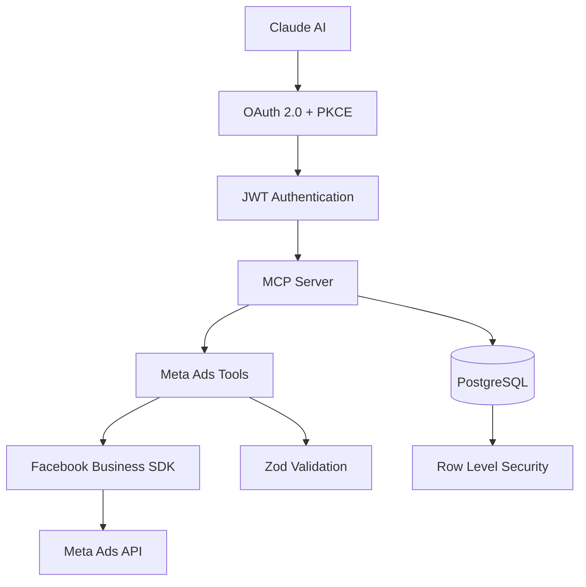

# Bamboo MCP Documentation

MCP server for Meta Ads management.

## Implementation Status

Core architecture is complete. The initial toolset covers ad accounts, campaigns, and ad sets.

- McpServer with registerTool/registerResource methods
- StreamableHTTPServerTransport implementation  
- Custom OAuth 2.0 provider with refresh token rotation
- Database-backed client registration and token management
- JWT + RLS authentication architecture

---

## Documentation

| Document | Description |
|----------|-------------|
| **[Architecture](ARCHITECTURE.md)** | System design and components |
| **[API Reference](API_REFERENCE.md)** | OAuth endpoints, MCP tools, schemas |
| **[Security Guide](SECURITY.md)** | OAuth 2.1, JWT, RLS |
| **[Deployment Guide](DEPLOYMENT.md)** | Production deployment |

---

## Quick Start

### Prerequisites
- Node.js 18+
- PNPM
- Supabase account
- Facebook Developer account

### Installation
```bash
git clone <repository-url>
cd bamboo-mcp
pnpm install
cp .env.example .env
# Edit .env with your configuration
```

### Setup
1. **Database**: Create Supabase project, run migrations
2. **Facebook App**: Create app, configure OAuth settings
3. **Development**: `pnpm dev`

---

## Architecture



### Stack
- **HTTP**: Fastify v5.4.0
- **Validation**: Zod schemas
- **Auth**: OAuth 2.0 + PKCE + JWT
- **Database**: PostgreSQL with Drizzle ORM
- **MCP**: TypeScript SDK v1.13.0
- **Meta**: Facebook Business SDK v22.0.3

---

## Features

### Security
- OAuth 2.1 with PKCE
- JWT with HS256 signing
- Row-level security with Drizzle
- Session-based user context
- Input validation with Zod schemas
- Response sanitization

### MCP Protocol
- 10 tools covering core Meta Ads operations
- Multi-account management
- System prompts and best practices as resources
- JSON-RPC error responses
- Bearer token authentication

### Production
- Health monitoring via `/health` endpoint
- Structured JSON logging
- Circuit breaker and retry policies
- Graceful error recovery

---

## Tools

### Account Management
| Tool | Purpose |
|------|---------|
| `get_ad_accounts` | List all ad accounts |
| `select_ad_account` | Select default ad account |

### Campaign Management
| Tool | Purpose |
|------|---------|
| `get_campaigns` | List campaigns |
| `create_campaign` | Create campaign |
| `update_campaign` | Update campaign |
| `delete_campaign` | Delete campaign |

### Ad Set Management
| Tool | Purpose |
|------|---------|
| `get_adsets` | List ad sets |
| `create_adset` | Create ad set |
| `update_adset` | Update ad set |
| `delete_adset` | Delete ad set |

---

## Development

### Local Development
```bash
pnpm dev              # Start development server
pnpm checks           # Run lint, format, and TypeScript check
pnpm test             # Run unit tests
pnpm mcp:inspect:http # Test with MCP Inspector
```

### Testing with MCP Inspector

Inspector requires valid OAuth tokens. Complete the OAuth flow first:
```bash
pnpm dev
# Visit: http://localhost:3000/authorize?client_id=test&redirect_uri=http://localhost:3000&code_challenge=test&code_challenge_method=S256
```

**HTTP Transport (Recommended)**
```bash
# Terminal 1: Start server
pnpm dev

# Terminal 2: Connect inspector
pnpm mcp:inspect:http
```

**Available Resources**:
- `bamboo://prompts/system`: System prompt (text/plain)
- `bamboo://prompts/best-practices`: Best practices (text/markdown)

**Available Tools**: All 10 tools listed above

### Troubleshooting
- **"No user found"**: Complete OAuth flow to create test user
- **HTTP connection issues**: Ensure main server is running on port 3000
- **Authentication failures**: Verify JWT tokens in Authorization headers

---

## Deployment

```
Claude ←→ Render.com ←→ Supabase ←→ Meta Ads API
         (Node.js)    (PostgreSQL)
```

- **Render.com**: Auto-deployment from GitHub
- **Supabase**: Managed PostgreSQL with RLS
- **Facebook**: Business app with OAuth approval

See [Deployment Guide](DEPLOYMENT.md) for complete setup.

---

## References

- [Model Context Protocol Specification](https://spec.modelcontextprotocol.io/)
- [Facebook Business SDK Documentation](https://developers.facebook.com/docs/business-sdk)
- [OAuth 2.1 Security Best Practices](https://datatracker.ietf.org/doc/html/draft-ietf-oauth-security-topics)
- [Drizzle ORM Documentation](https://orm.drizzle.team/) 