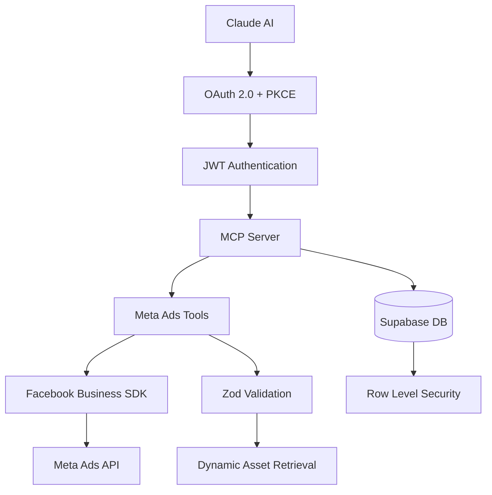

# Bamboo MCP Documentation

**Implementation documentation for Bamboo MCP - An MCP server for Meta Ads management.**

## ✅ **Implementation Complete**

**The MCP server has been successfully implemented with 2025 best practices and enhanced OAuth security.**

- **Completed**: Migration to `McpServer` with `registerTool`/`registerResource` methods
- **Completed**: Modern `StreamableHTTPServerTransport` implementation
- **Completed**: Custom OAuth 2.0 provider with refresh token rotation
- **Completed**: Database-backed client registration and token management
- **Completed**: Code refactoring for improved maintainability and testability
- **Preserved**: Robust JWT + RLS authentication architecture
- **Status**: Production-ready with comprehensive OAuth 2.0 security

📋 **See**: [Implementation Plan](IMPLEMENTATION_PLAN.md) for complete details

---

## Documentation Overview

This documentation covers implementation, deployment, and maintenance of Bamboo MCP.

### Quick Navigation

| Document | Description | Key Topics |
|----------|-------------|------------|
| **[🚨 MCP Refactoring Plan](MCP_REFACTORING_PLAN.md)** | **URGENT: SDK Migration Guide** | **Anti-patterns, refactoring steps, timeline** |
| **[Implementation Plan](IMPLEMENTATION_PLAN.md)** | Master implementation guide | Project overview, dependencies, structure |
| **[Architecture](ARCHITECTURE.md)** | System design and architecture | Components, data flow, security layers |
| **[Code Examples](CODE_EXAMPLES.md)** | Complete code implementations | TypeScript examples, configurations |
| **[API Reference](API_REFERENCE.md)** | Complete API documentation | OAuth endpoints, MCP tools, schemas |
| **[Security Guide](SECURITY.md)** | Security and compliance | OAuth 2.1, JWT, RLS, monitoring |
| **[Deployment Guide](DEPLOYMENT.md)** | Production deployment | Render.com, Supabase, Facebook setup |

---

## Quick Start

### Prerequisites
- Node.js 18+
- PNPM package manager
- Supabase account
- Facebook Developer account
- Render.com account (for deployment)

### Installation Steps
1. **Clone Repository**
   ```bash
   git clone <repository-url>
   cd bamboo-mcp
   ```

2. **Install Dependencies** (using exact versions from our research)
   ```bash
   # Production dependencies
   pnpm add @modelcontextprotocol/sdk@1.12.3
   pnpm add fastify@^5.1.0 @fastify/cors@^10.0.1
   pnpm add fastify-type-provider-zod@^4.0.1
   pnpm add drizzle-orm@^0.33.0 @supabase/supabase-js@^2.45.4 postgres@^3.4.4
   pnpm add facebook-nodejs-business-sdk@22.0.3
   pnpm add jsonwebtoken@^9.0.2 zod@^3.23.8 
   pnpm add pkce-challenge@^5.0.0 dotenv@^16.4.5

   # Development dependencies
   pnpm add -D typescript@^5.5.4 @types/node@^22.5.4 tsx@^4.19.2
   pnpm add -D @types/jsonwebtoken@^9.0.6 @types/facebook-nodejs-business-sdk@22.0.0
   pnpm add -D drizzle-kit@^0.24.0
   pnpm add -D vitest@^2.1.4 @vitest/ui@^2.1.4 supertest@^7.0.0 @types/supertest@^6.0.2
   ```

3. **Environment Setup**
   ```bash
   cp .env.example .env
   # Edit .env with your configuration
   ```
   
   **Key Environment Variables:**
   - `DATABASE_URL`: PostgreSQL connection string from Supabase (for Drizzle ORM)
   - `SUPABASE_URL` + `SUPABASE_*_KEY`: Supabase client API (for auth/storage)
   - Both are required: DATABASE_URL for direct DB access, Supabase vars for auth features

4. **Database Setup**
   - Create Supabase project
   - Run SQL migration from [Deployment Guide](DEPLOYMENT.md)
   - Configure RLS policies

5. **Facebook App Setup**
   - Create Facebook Business app
   - Configure OAuth settings
   - Submit for app review

6. **Development**
   ```bash
   pnpm dev  # Start development server with tsx hot reload
   ```

---

## System Architecture



### Core Components
- **HTTP Framework**: Fastify v5.1.0 (preferred over Express for TypeScript)
- **Validation**: Fastify + Zod integration via `fastify-type-provider-zod`
- **Authentication**: OAuth 2.0 + PKCE + JWT (using pkce-challenge helper)
- **Database**: Direct PostgreSQL connection with Drizzle ORM
- **Row-Level Security**: Type-safe RLS policies with session-based isolation
- **MCP Protocol**: TypeScript SDK v1.12.3 with StdioServerTransport (dev) + StreamableHTTPServerTransport (prod)
- **Meta Integration**: Facebook Business SDK v22.0.3
- **Testing**: Vitest + MCP Inspector for comprehensive testing
- **Deployment**: Render.com with health checks

---

## Key Features

### Security
- OAuth 2.1 with PKCE for all clients
- JWT with RS256/ES256 signing algorithms
- Database security with Drizzle RLS and type-safe policies
- Session-based user context enforcement
- Input validation with Zod schemas
- HTTPS with security headers

### MCP Protocol Support
- 40+ specialized tools covering Meta APIs (Ads, Pages, Commerce, Business)
- Multi-account management with intelligent selection
- Generic API access via `call_meta_api` for any Meta endpoint
- System prompts and best practices as resources
- Structured JSON-RPC error responses
- Bearer token authentication

### Production Features
- Health monitoring via `/health` endpoint
- Structured JSON logging
- Rate limiting per user and IP
- Graceful error recovery

### User Experience
- Inline asset display for accurate image selection
- Structured error responses with clear guidance
- Smart account selection (automatic for single accounts)
- Visual asset management with thumbnails and metadata

---

## MCP Tools Reference

### Complete Meta API Coverage (40+ Tools)

#### Account Management (3 tools)
| Tool | Purpose | Multi-Account Support |
|------|---------|----------------------|
| `get_ad_accounts` | List all ad accounts with permissions | Discovery & selection |
| `get_business_accounts` | List business accounts | Business-level access |
| `select_ad_account` | Select account for session | Context management |

#### Campaign Management (4 tools)
| Tool | Purpose | Account Context |
|------|---------|----------------|
| `get_campaigns` | List campaigns with filtering | Auto-selected or specified |
| `create_campaign` | Create new campaigns | Auto-selected or specified |
| `update_campaign` | Update existing campaigns | Inherited from campaign |
| `delete_campaign` | Delete campaigns | Inherited from campaign |

#### Creative & Asset Management (6 tools)
| Tool | Purpose | Account Context |
|------|---------|----------------|
| `get_ad_creatives` | List ad creatives | Auto-selected or specified |
| `create_ad_creative` | Create new creatives | Auto-selected or specified |
| `get_uploaded_assets` | List media assets | Auto-selected or specified |
| `upload_ad_asset` | Upload images/videos | Auto-selected or specified |
| `update_ad_creative` | Update existing creatives | Inherited from creative |
| `delete_ad_creative` | Delete creatives | Inherited from creative |

#### Additional Tool Categories
- Ad Set Management (4 tools): Complete ad set lifecycle
- Ad Management (4 tools): Individual ad operations  
- Audience Management (4 tools): Custom audience handling
- Insights & Reporting (4 tools): Performance analytics
- Page Management (3 tools): Facebook Page operations
- Business Management (2 tools): Business account operations
- Commerce & Catalog (6 tools): Product catalog management
- Generic API Access (1 tool): Direct Meta API calls

### Multi-Account Handling
- Automatic selection for single account users
- User prompting when multiple accounts are available
- Session persistence for selected account
- Permission awareness based on user's role
- Explicit override via `adAccountId` parameter

---

## Security Highlights

### OAuth 2.1 Compliance
- PKCE required for all authorization flows
- S256 code challenge method only
- Secure redirect URI validation
- State parameter for CSRF protection

### Database Security
- Native Drizzle RLS with type-safe policies defined in TypeScript
- Standard PostgreSQL compatible with any database (Supabase, AWS RDS, etc.)
- Session-based isolation using PostgreSQL session variables
- Migration management with versioned RLS policies
- Separate policies for SELECT, INSERT, UPDATE, DELETE operations
- SSL/TLS enforced for all database connections

### API Security
- Rate limiting per user and IP
- JWT token validation on every request
- Input sanitization via Zod schemas
- Comprehensive error handling

---

## Deployment Architecture

### Production Stack
```
Claude ←→ Render.com ←→ Supabase ←→ Meta Ads API
         (Node.js)    (PostgreSQL)
```

### Environment Configuration
- **Render.com**: Auto-deployment from GitHub
- **Supabase**: Managed PostgreSQL with RLS
- **Facebook**: Business app with OAuth approval
- **Monitoring**: Health checks and structured logging

---

## Monitoring & Observability

### Health Checks
```json
{
  "status": "healthy",
  "timestamp": "2025-01-01T00:00:00.000Z",
  "version": "0.1.0",
  "database": "connected",
  "mcp": "ready"
}
```

### Security Monitoring
- Authentication attempts and failures
- Token usage patterns and anomalies
- API rate limit violations
- Database connection issues
- Suspicious activity detection

---

## Development Workflow

### Local Development
1. **Environment Setup**: Configure `.env` file
2. **Database Migration**: Run Supabase SQL scripts
3. **Development Server**: `pnpm dev` (uses tsx for hot reload)
4. **Testing**: 
   - Unit tests: `pnpm test` (Vitest)
   - Interactive testing: `pnpm test:ui`
   - MCP debugging: `pnpm mcp:inspect` (MCP Inspector)
5. **Type Checking**: `pnpm lint`

### Testing with MCP Inspector

The MCP Inspector is a web-based tool for testing and debugging MCP servers interactively.

#### Prerequisites for Inspector Testing
1. **User Account Required**: You must have at least one user in your database for development mode authentication. Run the OAuth flow once by:
   ```bash
   pnpm dev  # Start the server
   # Visit http://localhost:3000/authorize?client_id=test&redirect_uri=http://localhost:3000&code_challenge=test&code_challenge_method=S256
   # Complete the Facebook OAuth flow
   ```

2. **Development Environment**: The server must be running in development mode (`NODE_ENV=development`) for automatic test user authentication.

#### Running the Inspector

**Option 1: HTTP Transport (Recommended)**
```bash
# Terminal 1: Start the main HTTP server
pnpm dev

# Terminal 2: Connect inspector via HTTP
pnpm mcp:inspect:http
```
This connects the inspector to the existing HTTP server at `http://localhost:3000/mcp`. This approach avoids stdio issues and provides cleaner debugging.

**Option 2: Stdio Transport**
```bash
pnpm mcp:inspect:stdio
```
This uses the included `mcp-inspector.config.json` to automatically start both the server and inspector using stdio communication.

**Option 3: Manual Two-Terminal Setup**
**Terminal 1: Start MCP Server (stdio mode)**
```bash
pnpm mcp:server:stdio
```
This starts the MCP server in stdio mode, listening for inspector connections.

**Terminal 2: Launch MCP Inspector**
```bash
pnpm mcp:inspect
```
This opens the MCP Inspector web interface that connects to your server.

#### Using the Inspector
1. **List Available Resources**: Click "List Resources" to see all available MCP resources
2. **Read Resources**: 
   - Select a resource URI (e.g., `bamboo://prompts/system`, `bamboo://prompts/best-practices`)
   - Click "Read Resource" to fetch the content
3. **List Available Tools**: Click "List Tools" to see all registered MCP tools  
4. **Test Tools**: 
   - Select a tool from the dropdown (e.g., `get_ad_accounts`, `get_campaigns`)
   - Fill in any required parameters
   - Click "Call Tool" to execute
5. **Review Results**: Resource content and tool responses appear in the response panel
6. **Authentication**: In development mode, the server automatically uses the first user from your database - no manual token required

#### Available Resources and Tools for Testing

**Resources** (data/context access):
- `bamboo://prompts/system`: System prompt for the AI agent (text/plain)
- `bamboo://prompts/best-practices`: Meta Ads best practices document (text/markdown)

**Tools** (executable actions):
- `get_ad_accounts`: Lists user's ad accounts (no parameters)
- `get_campaigns`: Lists campaigns (requires `adAccountId` parameter)

#### Troubleshooting Inspector
- **"No user found" error**: Complete the OAuth flow once to create a test user
- **HTTP connection issues**: Ensure the main server is running (`pnpm dev`) before using HTTP transport
- **Port conflicts**: The HTTP approach uses port 3000 - ensure it's available
- **JSON parsing errors with stdio**: Use HTTP transport (`pnpm mcp:inspect:http`) instead of stdio
- **Connection issues with stdio**: Ensure the stdio server is running in Terminal 1 (manual setup only)
- **Environment variable errors**: Ensure your `.env` file exists and contains required variables
- **Tool errors**: Check server logs for detailed error information  
- **Authentication failures**: Verify `NODE_ENV=development` is set
- **Database connection issues**: Verify `DATABASE_URL` is correctly configured in `.env`

### Production Deployment
1. **GitHub Integration**: Push to connected repository
2. **Automatic Build**: Render.com builds and deploys
3. **Environment Variables**: Configure via Render dashboard
4. **Health Validation**: Monitor `/health` endpoint

---

## Additional Resources

### Documentation Deep Dives
- **[Implementation Plan](IMPLEMENTATION_PLAN.md)**: Complete technical specifications
- **[Security Guide](SECURITY.md)**: Comprehensive security measures
- **[API Reference](API_REFERENCE.md)**: Detailed endpoint documentation

### External References
- [Model Context Protocol Specification](https://spec.modelcontextprotocol.io/)
- [Facebook Business SDK Documentation](https://developers.facebook.com/docs/business-sdk)
- [OAuth 2.1 Security Best Practices](https://datatracker.ietf.org/doc/html/draft-ietf-oauth-security-topics)
- [Supabase Row Level Security Guide](https://supabase.com/docs/guides/auth/row-level-security)
- [Drizzle ORM Documentation](https://orm.drizzle.team/)

---

## Key Design Decisions

### Why These Technologies?
- MCP SDK v1.12.3: Latest stable version with current spec compliance
- Facebook Business SDK v22.0.3: Current version with TypeScript support
- Supabase + Drizzle: Type-safe ORM with built-in RLS and auth
- Render.com: Production-ready hosting with automatic deployments

### Security-First Approach
- OAuth 2.1 compliance with mandatory PKCE
- JWT with RS256/ES256 algorithms
- Database-level security with RLS policies
- Input validation and sanitization

### Claude Integration Focus
- Stateless server design for autonomous operation
- Complete toolset for end-to-end campaign management
- Structured error responses for reliable orchestration
- Resource endpoints for context and best practices

---

## Support & Troubleshooting

### Common Issues
- **OAuth Flow Failures**: Check callback URLs and PKCE implementation
- **Database Errors**: Verify RLS policies and user context
- **API Rate Limits**: Implement exponential backoff and monitor usage
- **Token Issues**: Validate JWT format and expiration

### Getting Help
1. Review the relevant documentation section
2. Check the troubleshooting guide in [Deployment](DEPLOYMENT.md)
3. Validate configuration against security checklist
4. Monitor application logs for detailed error information

---

**Bamboo MCP - MCP server for autonomous Meta Ads management.** 